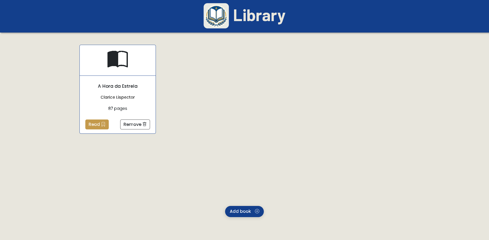

# 📚 Library App

Uma aplicação simples de biblioteca desenvolvida com **HTML, CSS, Bootstrap e JavaScript**, onde é possível adicionar, visualizar, marcar como lido e remover livros.

> ⚠️ **Projeto estudantil** desenvolvido com base no desafio proposto pelo **The Odin Project**, com o objetivo de praticar lógica de programação, manipulação do DOM e organização de código em JavaScript.

---

## 🚀 Live Preview

🔗 **Acesse o projeto online:**
👉 https://anaclarissi.github.io/library-odin-project/

🖼️ **Preview do projeto:**


---

## 🔗 Links

* 💻 GitHub: https://github.com/anaClarissi/library-odin-project
* 💼 LinkedIn: https://www.linkedin.com/in/anaclarissi

---

## 📌 Sobre o projeto

Este projeto simula uma pequena biblioteca onde o usuário pode:

* 📖 Adicionar novos livros
* 📚 Visualizar livros em formato de cards
* ✅ Marcar livros como lidos ou não lidos
* 🗑️ Remover livros da biblioteca

Todos os dados são manipulados em memória utilizando um array de objetos.

---

## 🧠 Conceitos aplicados

* Programação orientada a objetos (constructor function)
* Manipulação do DOM
* Eventos em JavaScript
* Uso de `event.preventDefault()`
* Estruturação de dados com arrays
* Identificação única com `crypto.randomUUID()`
* Separação de responsabilidades (dados vs interface)

---

## 🛠️ Tecnologias utilizadas

* HTML5
* CSS3
* Bootstrap 5
* Bootstrap Icons
* JavaScript (Vanilla JS)

---

## 🧩 Funcionalidades principais

### ➕ Adicionar livro

Um modal permite inserir:

* Título
* Autor
* Número de páginas
* Status de leitura

### 🔄 Alterar status

Botão para alternar entre:

* **Read**
* **Unread**

### ❌ Remover livro

Cada card possui um botão para excluir o livro da lista.

---

## 📁 Estrutura do projeto

```
📦 library-app
 ┣ 📂 src
 ┃ ┣ 📂 css
 ┃ ┣ 📂 js
 ┃ ┣ 📂 assets
 ┣ 📄 index.html
 ┣ 📄 README.md
```

---

## 📚 Aprendizados

Durante o desenvolvimento deste projeto, foram reforçados conceitos importantes como:

* Organização de código em funções reutilizáveis
* Separação entre lógica e interface
* Criação dinâmica de elementos HTML
* Gerenciamento de estado com arrays

---

## ✨ Melhorias futuras

* Persistência de dados com LocalStorage
* Edição de livros
* Filtros (lidos / não lidos)
* Responsividade aprimorada
* Animações e microinterações

---

## 📌 Créditos

Projeto baseado no desafio da plataforma:
👉 https://www.theodinproject.com/

---

## 👩‍💻 Autora

Desenvolvido por **Ana Clarissi** 💙
